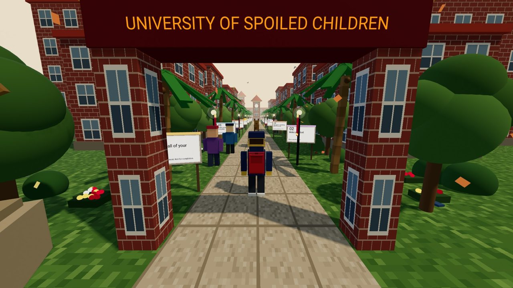
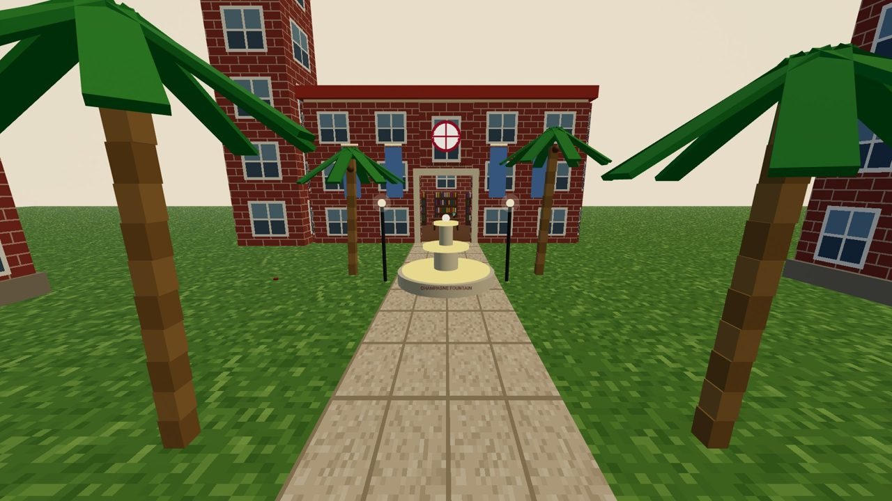
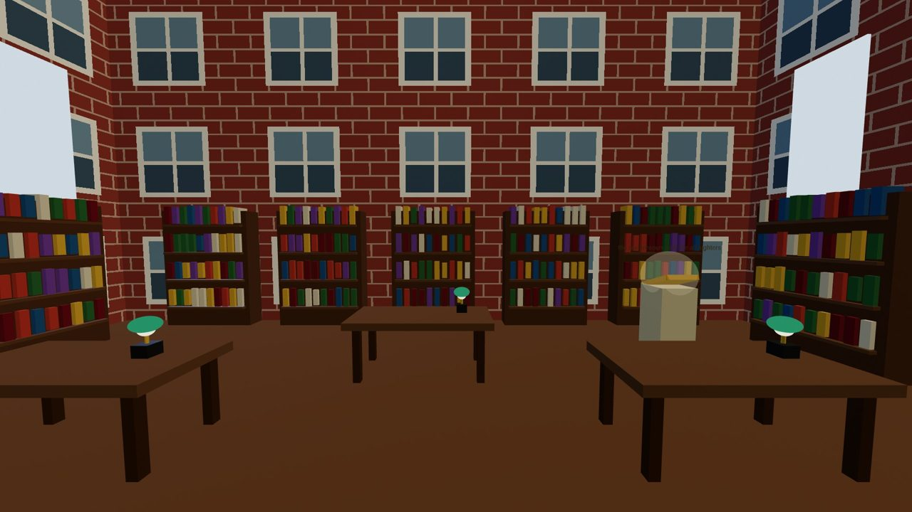

# 🎓 University of Spoiled Children

A walkable, Roblox-style 3D college campus you explore right in your browser — a playful homage to USC, built as a single self-contained HTML file. Stroll the quad in third person, walk up to signboards to learn study strategies, and chat with a cast of (slightly ridiculous) students.

It's based on **Cal Newport's _How to Win at College_** — every signboard you reach teaches one of its strategies in your own words.



> ⚠️ **Work in progress, built in public.** This is an early prototype that grows a little every day — see the [Progress log](#-progress-log) below for what's new.

## 💡 Why build a book this way?

I didn't want to make another summary of _How to Win at College_. Those are everywhere, and they slide right off your brain. The whole book is about _doing_ college — showing up, walking to office hours, putting a sign on your wall — so reading the advice as a flat bullet list always felt backwards to me.

So I turned it into a place. Each strategy lives on a signboard somewhere on the quad, and the only way to learn it is to physically walk up to it. You can't skim the whole thing in thirty seconds — you have to wander, get a little lost, and stumble onto the next idea. That tiny bit of effort, the walk itself, is the point. It makes a piece of advice feel like something you _found_ instead of something you were told, and that's the thing that actually sticks.

Making it a walkable USC parody is just what made it fun to build. Palm trees, a clock tower, Tommy Trojan talking nonsense, a Metro train rolling past — the satire keeps it light while the real study tips do their quiet work in the background. A book becomes a world you walk through, and "finishing" it means you graduate.

### How it works

- Walk up to a signboard → it opens into a card and ticks up your progress (Freshman → Senior).
- Collect all 16 strategies → you **graduate**, confetti and all.
- Talk to the NPCs for the jokes; read the boards for the substance.
- The entire world is **one `index.html`** — [A-Frame](https://aframe.io/) handles the 3D, and the pixel-art textures and buildings are generated in Python and baked into the file as data URIs. Nothing to install, nothing fetched from a server. Open the file and you're on campus.

## ▶️ Play it

Live demo: **https://wuisabel-gif.github.io/cube/**
_(enable GitHub Pages: Settings → Pages → Source: `main` / root)_

📺 **Play log / walkthrough:** https://www.youtube.com/watch?v=b8ictMvaxNo

Or just open `index.html` in any modern browser. No install, no build step. Works in VR too.

## 🎮 Controls

| Action | Input |
| --- | --- |
| Walk | `W` `A` `S` `D` |
| Run | hold `Shift` |
| Look around | click + drag |
| Learn a strategy | walk up to a signboard |
| Talk to a classmate | walk up + press `E` (or `Space`) |

## ✨ Features

- Third-person, Roblox-style character (walk + run, with limb animation)
- 16 interactive strategy boards from _How to Win at College_
- Walk-up-to-learn mechanic + a "Roger that" acknowledge button
- Progress tracking and a graduation celebration when you collect all 16
- Funny NPCs you can talk to (Tommy Trojan, professors, a club recruiter, a tour guide)
- Pixel-art textures, palm trees, a clock tower, statues, and a moving Metro train
- Chunky, Roblox-style game UI
- Generated campus sounds (footsteps, a chime when you learn, ambient birds) with a mute toggle

## 🖼️ Screenshots

| The quad | Dougheny Library | Inside the library |
| --- | --- | --- |
|  |  |  |

## 📈 Progress log

Built in public — a bit every day. Newest first.

### 2026-06-22
- 📖 The golden book in the library is now **collectible** — walk up, press `E`, and a "Secret Found!" reward pops.
- Added these screenshots + this progress log.

### 2026-06-21
- 🏛️ Made the **Dougheny Library enterable** — walk through the door into a lit reading room (bookshelf stacks, study tables with green banker lamps, a checkout desk) with a hidden golden book inside.
- 🗺️ Extended the campus: a grand **library landmark** (USC Doheny-inspired), a **champagne fountain** plaza, scattered litter, and hidden text easter eggs.
- 🧑‍🎓 Upgraded the **main character** (expressive face, brown hair, red backpack, lanyard) and gave **every classmate a face**; scaled classmates to match the player.
- 🎮 Reworked the **classmate interaction**: press `E` to talk (with a floating hint) + **solid collision** so you can't walk through people.
- 🖥️ New UI: **NPC dialogue portraits**, category **icons**, a **minimap / radar**, "lesson learned" toast, and a 🎓 favicon.
- 🏗️ Initial release: a walkable 3D quad, 16 strategy boards, talkable NPCs, a clock tower, statues, and a moving Metro train, with a redesigned game UI.

## 🛠️ Tech

- [A-Frame](https://aframe.io/) (WebXR / Three.js) loaded from CDN
- Procedurally generated pixel-art textures (baked into the file as data URIs)
- Everything ships in one `index.html` — no dependencies to install

## 🧱 Building from source (optional)

The HTML is generated by Python scripts in `build/` (texture generation + scene assembly). To rebuild:

```bash
cd build
python3 build_campus.py   # writes index.html
```

## 🙏 Credits

- Strategies inspired by **_How to Win at College_ by Cal Newport** (paraphrased, not reproduced).
- "University of Spoiled Children" is an affectionate parody nickname — not affiliated with or endorsed by USC.

## 📄 License

[MIT](LICENSE)
